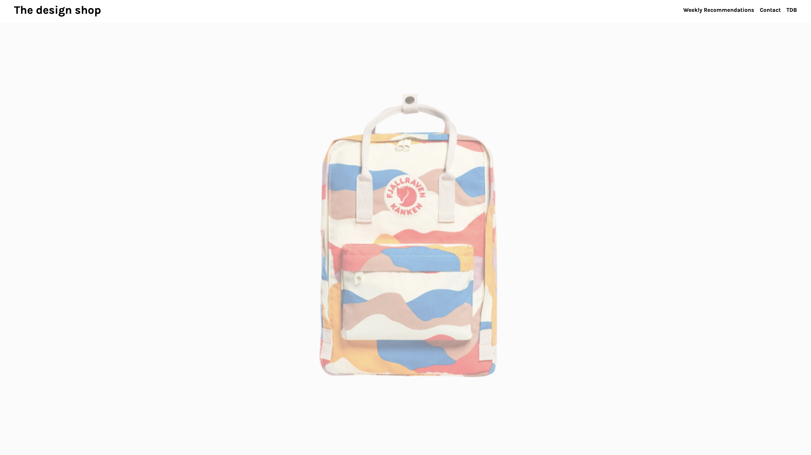
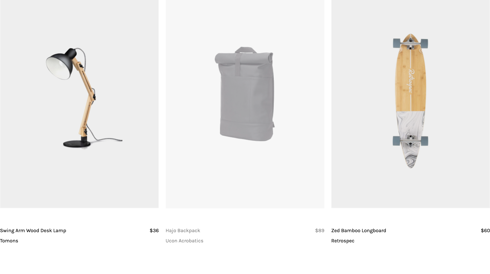

# Project The Design Shop

## Overview
Project The Design Shop is an online store featuring carefully curated design products. This website showcases a variety of items ranging from backpacks and desk lamps to books and office chairs. It provides a clean and straightforward interface for users to browse and explore different design products.

## Features
- **Product Display:** A wide range of products with details such as name, brand, and price.
- **Navigation:** Easy navigation with links to weekly recommendations, contact information, and TDB (The Design Blog).
- **Footer Information:** Contact details, newsletter subscription, social media links, and a brief description of the shop.

## Usage
1. **Browse Products:**
   - The main section displays a variety of products. Each product is listed with its name, brand, and price.

2. **Navigate Through the Site:**
   - The header contains a navigation bar with links to "Weekly Recommendations," "Contact," and "TDB."

3. **Footer Information:**
   - The footer provides additional information including contact details, a brief about the shop, newsletter subscription, and social media links.

## Components
- **Header:** Contains the shop name and navigation links.
- **Main Section:** Displays the products in a structured layout.
- **Footer:** Provides additional information and links for user interaction.

## Installation
1. **Download/Clone the Repository.**
2. **Open the HTML File** in a web browser to view the website.

## Live Demo
Experience the online store: [Project The Design Shop](https://lisayl1688.github.io/Project-The-Design-Shop/)

## License
Licensed under the MIT License.

Explore our curated design products and enjoy a seamless shopping experience!
